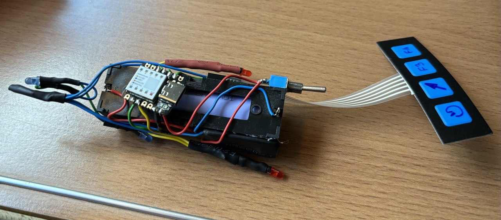

# hantim

This is the code for Seed-Studio-based timer and desk lighter that I built as a gift for a good friend.

It is just neat lighting for the desk, which has a timer mode built-in that changes the light color after 45 and then after 90 minutes, indicating that a pause should be made.

